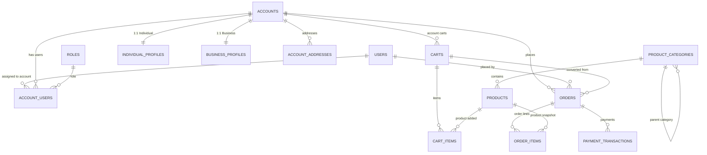

# 📦 FSI E-Commerce — Database Design (MySQL)

This document describes the complete relational database model used in the **FSI E-Commerce Platform**, built on **MySQL** using Clean Architecture and Clean Code principles.

The schema supports:

- Individual (B2C) and Business (B2B) accounts  
- Multi-user accounts with roles and permissions  
- Registered and guest shoppers  
- Persistent shopping carts  
- Orders with snapshots (immutable historical data)  
- Payment transactions with multiple operations per order  

---

## 🧩 High-Level Architecture

The data model is organized into four main domains:

1. **Identity & Accounts**
2. **Product Catalog**
3. **Cart & Ordering**
4. **Payments**

This structure ensures scalability, clear separation of responsibilities, and high performance by minimizing heavy joins.

---

## 🗺️ Entity Relationship Diagram (ERD)

# 🧱 Table-by-Table Documentation

## **roles**

| Column | Description |
|--------|-------------|
| id | Primary key |
| code | Role code (`OWNER`, `ADMIN`, `BUYER`, `VIEWER`) |
| name | Display name |
| description | Optional description |

---

## **users**

| Column | Description |
|--------|-------------|
| id | Primary key |
| email | Unique login email |
| password_hash | Encrypted password |
| is_active | Indicates user status |
| created_at / updated_at | Audit timestamps |

---

## **accounts**

| Column | Description |
|--------|-------------|
| id | Primary key |
| account_type | `INDIVIDUAL` or `BUSINESS` |
| display_name | Full name or trade name |
| email | Primary email |
| phone_number | Contact number |
| created_at / updated_at | Audit timestamps |

Relationships:  
1:1 with individual_profiles  
1:1 with business_profiles  
1:N with account_users  
1:N with account_addresses  
1:N with carts  
1:N with orders

---

## **individual_profiles**

| Column | Description |
|--------|-------------|
| account_id | FK → accounts.id |
| first_name | First name |
| last_name | Last name |
| national_id | CPF/SSN |

---

## **business_profiles**

| Column | Description |
|--------|-------------|
| account_id | FK → accounts.id |
| company_name | Legal corporate name |
| trade_name | Business name |
| tax_id | CNPJ/VAT |
| state_registration | Optional |

---

## **account_users**

| Column | Description |
|--------|-------------|
| id | PK |
| account_id | FK |
| user_id | FK |
| role_id | FK |
| is_default_account | Marks primary account |

---

## **account_addresses**

| Column | Description |
|--------|-------------|
| id | PK |
| account_id | FK |
| label | Home, Billing, Headquarters... |
| line1 / line2 | Address |
| city | City |
| state | State |
| postal_code | ZIP |
| country_code | ISO-3166-1 |
| is_default_shipping | Boolean |
| is_default_billing | Boolean |

---

## **product_categories**

| Column | Description |
|--------|-------------|
| id | PK |
| name | Category name |
| slug | URL-friendly name |
| parent_id | Self-FK |

---

## **products**

| Column | Description |
|--------|-------------|
| id | PK |
| category_id | FK |
| sku | Stock code |
| name | Product name |
| description | Description |
| price | Decimal |
| currency | USD/BRL/etc |
| stock_quantity | Stock |
| is_active | Boolean |

---

## **carts**

| Column | Description |
|--------|-------------|
| id | PK |
| account_id | FK |
| guest_token | Token for guest checkout |
| status | OPEN / CONVERTED / ABANDONED |

---

## **cart_items**

| Column | Description |
|--------|-------------|
| id | PK |
| cart_id | FK |
| product_id | FK |
| quantity | Units |
| unit_price | Snapshot price |

---

## **orders**

| Column | Description |
|--------|-------------|
| id | PK |
| order_number | Unique readable number |
| account_id | FK |
| placed_by_user_id | FK |
| cart_id | FK |
| total_amount | Total |
| currency | Currency |
| shipping_* | Shipping snapshot |
| billing_* | Billing snapshot |

---

## **order_items**

| Column | Description |
|--------|-------------|
| id | PK |
| order_id | FK |
| product_id | FK |
| product_name | Snapshot |
| unit_price | Snapshot |
| quantity | Qty |
| line_total | Total |

---

## **payment_transactions**

| Column | Description |
|--------|-------------|
| id | PK |
| order_id | FK |
| method | Payment method |
| status | Payment status |
| amount | Value |
| currency | Currency |
| provider_transaction_id | Gateway ref |

---

# 🌱 Seed Data Summary

- Roles: OWNER, ADMIN, BUYER, VIEWER  
- Users: John Doe, Maria Buyer, ACME Employee  
- Accounts: PF (John), PJ (ACME)  
- Addresses: Home + HQ  
- Catalog: Electronics, Books  
- Products: Smartphone X, Headphones, Clean Architecture  
- Carts: Registered + Guest  
- Orders: One completed order  
- Payments: CAPTURED  

---

# 🎯 Design Principles Applied

- Clean Architecture  
- Snapshot-based order model  
- Multi-user account model  
- Guest checkout flow  
- Minimal JOIN dependency  
- Scalable domain design  

---

# 📁 SQL Setup

Database: `fsiecommercedb`  
Charset: `utf8mb4`  
Collation: `utf8mb4_unicode_ci`  

Execute full SQL schema + seed data to initialize environment.

---

