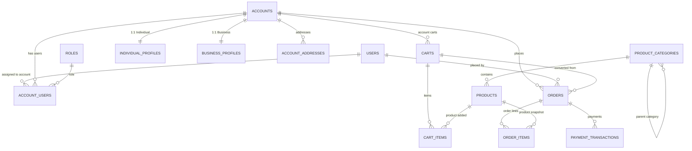

# 📦 FSI E-Commerce — Database Design (MySQL)

This document describes the complete relational database model used in the **FSI E-Commerce Platform**, built on **MySQL** using Clean Architecture and Clean Code principles.

The schema supports:

- Individual (B2C) and Business (B2B) accounts  
- Multi-user accounts with roles and permissions  
- Registered and guest shoppers  
- Persistent shopping carts  
- Orders with snapshots (immutable historical data)  
- Payment transactions with multiple operations per order  

---

## 🧩 High-Level Architecture

The data model is organized into four main domains:

1. **Identity & Accounts**
2. **Product Catalog**
3. **Cart & Ordering**
4. **Payments**

This structure ensures scalability, clear separation of responsibilities, and high performance by minimizing heavy joins.

---

## 🗺️ Entity Relationship Diagram (ERD)

